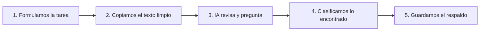

# Observatorio Regulatorio · Extracción IA de la Resolución 40505 de 2025

Este repositorio contiene el flujo que **sí produjo resultados consistentes** al analizar la [Resolución 40505 de 2025 del Ministerio de Minas y Energía](https://gestornormativo.creg.gov.co/gestor/entorno/docs/resolucion_minminas_40505_2025.htm). El pipeline `chunked_news_extraction.py` usa LangChain + Ollama en local para descargar la resolución, dividirla en fragmentos manejables y extraer listas de **personas**, **entidades** y **eventos** clave.

> ⚠️ Los demás scripts Python se mantienen fuera de este README porque no alcanzaron el desempeño esperado. Aquí solo se describe el flujo de fragmentación (`chunked_news_extraction.py`) y el despliegue de Ollama con Docker.

## Importancia del análisis regulatorio con IA local

- **Privacidad y confidencialidad**: al ejecutar los modelos en tu propia infraestructura no se exponen documentos sensibles ni trazas de uso a servicios externos.
- **Cumplimiento normativo**: los equipos jurídicos pueden auditar el flujo completo (desde la descarga hasta el JSON final) y mantener un registro verificable de cada corrida.
- **Reproducibilidad y control**: al fijar la versión del modelo y los prompts, cada análisis puede replicarse para sustentar decisiones regulatorias o responder a entes de control.
- **Costos predecibles**: se evita depender de APIs de terceros y sus variaciones de precio o disponibilidad.

## Visión general del flujo por fragmentos

```text
PlaywrightURLLoader  ──► Texto limpio (sin script/style)
                ┌───── ► Chunking con solapamiento (2 000 + 100 caracteres)
                │
LangChain + Ollama ───► LLM local con formato JSON (Pydantic)
                │
                └───── ► Fusión de resultados y deduplicación
```

1. **Descarga confiable**: `PlaywrightURLLoader` renderiza la página y elimina elementos ruidosos.
2. **Fragmentación controlada**: cada chunk conserva contexto gracias al solapamiento de 100 caracteres.
3. **Modelo local**: `ChatOllama` ejecuta `gpt-oss:latest` (puedes cambiarlo) y responde en JSON validado con Pydantic.
4. **Merge inteligente**: se consolidan las listas y se eliminan duplicados manteniendo el orden original.

### Flujo explicado para equipos no técnicos

1. **Formulamos la tarea**: el equipo define qué quiere saber de la resolución y comparte el enlace oficial.
2. **Copiamos el texto limpio**: un navegador automático abre la página y quita menús, banners y anuncios para quedarnos solo con el contenido legal.
3. **La IA revisa y hace preguntas**: el asistente (Ollama) trabaja en el mismo computador y, si le falta contexto, vuelve a leer la página hasta cinco veces.
4. **Clasificamos lo encontrado**: el resultado se organiza siempre en tres listas fáciles de revisar: entidades, personas y hechos/decisiones.
5. **Guardamos el respaldo**: entregamos un archivo `data.json` con toda la información y un registro de lo que la IA consultó por si se necesita auditoría.



## Requisitos

- Python 3.10+
- [Ollama](https://ollama.com/) funcionando localmente
- Dependencias Python:
  ```bash
  pip install -r requirements.txt
  playwright install chromium
  ```

## Levantar Ollama por Docker

`docker-compose.yml` ya expone el puerto `11434` y reserva GPU si está disponible.

```bash
docker compose up -d
ollama pull gpt-oss:latest   # u otro modelo compatible
```

Una vez que el contenedor esté arriba, el script Python puede conectarse vía `http://localhost:11434`.

## Ejecución del pipeline principal

```bash
python chunked_news_extraction.py
```

- Cambia la URL editando `DEFAULT_URL` si necesitas otra norma.
- Ajusta `CHUNK_SIZE`/`CHUNK_OVERLAP` para documentos más extensos o equipos con menos RAM.
- El resultado estructurado se imprime en consola y se guarda como `data.json`.

## Carpeta `example/` y resultado de referencia

La carpeta `example/` almacena los **resultados obtenidos durante la experimentación**. Son JSON reales que documentan qué devolvió el pipeline bajo diferentes configuraciones de modelo.

`example/final.json` incluye un ejemplo generado con este flujo (se muestra completo a continuación):

```json
{
  "companies": [
    "MINISTERIO DE MINAS Y ENERGÍA",
    "Superintendencia de Servicios Públicos Domiciliarios",
    "Estado",
    "Comisión de Regulación",
    "CREG",
    "Sistema Interconectado Nacional (SIN)",
    "Comisión de Regulación de Energía y Gas",
    "Gobierno Nacional",
    "Operador de Red (OR)",
    "Sistema Único de Información (SUI) de la Superintendencia de Servicios Públicos Domiciliarios",
    "Liquidador y Administrador de Cuentas (LAC)",
    "AIR-e S. A. S. E. S. P.",
    "XM Compañía de Expertos en Mercados",
    "Oficina de Asuntos Regulatorios y Empresariales (OARE)",
    "Delegatura para la Protección de la Competencia de la Superintendencia de Industria y Comercio",
    "Superintendencia de Industria y Comercio",
    "Comisión de Regulación de Energía y Gas (CREG)"
  ],
  "persons": [
    "presidente de la República",
    "Karen Schutt Esmeral"
  ],
  "events": [
    "Resolución 40505 de 2025",
    "dictamen de lineamientos transitorios para la continuidad del servicio de energía",
    "El artículo 367 ibidem define las competencias y responsabilidades relativas a la prestación de los servicios públicos domiciliarios.",
    "El artículo 370 de la Constitución Política de Colombia corresponde al presidente de la República señalar las políticas generales de la administración y control y eficiencia de los servicios públicos domiciliarios.",
    "Se expidió el régimen general de los servicios públicos domiciliarios mediante las Leyes 142 y 143 de 1994.",
    "El artículo 2o de la Ley 142 de 1994 señala que le corresponde al Estado garantizar la calidad, la cobertura y la continuidad del servicio público.",
    "El artículo 4o de la Ley 143 de 1994 dispone que el Estado tendrá como uno de sus objetivos abastecer la demanda de electricidad de la comunidad bajo criterios económicos y de viabilidad financiera.",
    "Definición del objetivo fundamental de la regulación en el sector eléctrico por Ley 143 de 1994, artículo 20",
    "Asignación de la función de aprobar fórmulas tarifarias a la Comisión por Ley 143 de 1994, artículo 23 literal e",
    "Indicación del fin de la regulación para garantizar prestación confiable por Ley 142 de 1994, artículo 73",
    "Atribución de facultad de establecer fórmulas de tarifas a las Comisiones de Regulación por Ley 142 de 1994, artículo 73.11",
    "Adopción de metodología de remuneración de distribución por Resolución CREG 015 de 2018",
    "Definición de régimen transitorio especial por Ley 1955 de 2019, artículo 318",
    "Decreto número 1645 del 10 de septiembre de 2019 adicionó el artículo 2.2.3.2.2.1.1 del Decreto número 1073 de 2015",
    "Decreto número 1231 del 11 de septiembre de 2020 modificó las disposiciones del Decreto número 1073 de 2015",
    "Resolución número 40272 de 2020 del Ministerio de Minas y Energía estableció lineamientos para el régimen transitorio especial en materia tarifaria",
    "Resolución número 010 del 30 de enero de 2020 de la Comisión de Regulación de Energía y Gas reglamentó el Régimen Transitorio Especial Tarifario",
    "Resoluciones CREG 024 y CREG 025 del 26 de marzo de 2021, modificadas por las Resoluciones GREG 078 y CREG 079 del 24 de junio de 2021, aprobaron variables necesarias para calcular los i",
    "Aprobación de las variables necesarias para calcular ingresos y cargos asociados con la actividad de distribución de energía eléctrica (Resoluciones EG 078 y CREG 079 del 24 de junio de 2021)",
    "Modificación de las resoluciones EG 078 y CREG 079 por las Resoluciones CREG 501 010, 501 011 (1 de diciembre de 2023), 501 109 y 501 056 (2024)",
    "Establecimiento de mecanismos de seguimiento a planes de inversión y reducción de pérdidas (numerales 6.5 y 7.3.4.1 del anexo general de la Resolución CREG 015 de 2018)",
    "Establecimiento de esquema de verificación anual a indicadores de ejecución de planes de inversión",
    "Establecimiento de esquema de seguimiento para cancelación de plan cuando OR incumple índices de pérdidas (numerales 7.4.3.1 i y 7.3.6.4.2 de la Resolución CREG 015 de 2018)",
    "Procedimientos de seguimiento afectan cálculo del CPROG y pérdidas de transición (numeral 7.1.4.3.1 de la Resolución CREG 015 de 2018)",
    "Resolución CREG 101 028 de 2023",
    "Resolución número 20241000531665 del 11 de septiembre de 2024",
    "Resolución número 20251000004725 del 9 de enero de 2025",
    "Sentencia C-364-2025",
    "Orden de la Superintendencia de Servicios Públicos Domiciliarios de tomar posesión de los bienes, haberes y negocios de AIR-e S. A. S. E. S. P.",
    "Determinación de la modalidad de la toma de posesión con fines liquidatarios",
    "Declaración exequible del artículo 318 de la Ley 1955 de 2019",
    "Sentencia C-364 de 2025",
    "Ley 1955 de 2019",
    "Ley 142 de 1994",
    "Ley 143 de 1994",
    "expedición de la regulación",
    "adopción de lineamientos",
    "aplicación del régimen transitorio especial",
    "Presentación del último informe por el Administrador del Mercado de Energía Mayorista",
    "Radicación del informe con número 1-2025-045077 y Radicado XM 202544020128",
    "Comunicación del alto riesgo de la prestación del servicio público de energía eléctrica con corte a 5 de septiembre de 2025",
    "Identificación de adeudo de 2.2 billones de pesos al mercado de energía mayorista (MEM)",
    "Identificación de riesgo sistémico con seis agentes directos y veintitrés indirectos",
    "Adopción de lineamientos para fortalecer la continuidad del servicio público domiciliario de electricidad",
    "Presentación de razones técnicas y financieras para establecer disposiciones de continuidad del servicio",
    "Publicación del proyecto entre el 23 y 26 de octubre de 2025",
    "Análisis y resolución de comentarios recibidos en la matriz establecida",
    "Expedición de lineamientos transitorios para la continuidad del servicio de energía eléctrica",
    "Emisión de regulación por la CREG para suspensión temporal de efectos tarifarios asociados a planes de inversión y reducción de pérdidas",
    "Adopción de medida de suspensión por la CREG con vigencia de dos años",
    "Posible continuación de la medida tras el tercer año si persisten condiciones técnicas",
    "Resolución del Ministerio de Minas y Energía 40272 de 2020",
    "Modificación de la Resolución del Ministerio de Minas y Energía 40272 de 2020",
    "Establecimiento de mecanismos y condiciones para la implementación de esquemas de devolución tarifario",
    "Reducción del plazo de recuperación de los saldos por opción tarifaria",
    "Modificación del artículo 2o de la Resolución del Ministerio de Minas y Energía 40272 de 2020",
    "Modificación aprobada bajo el artículo 318 de la Ley 1955 de 2019",
    "Publicación de la resolución en el Diario Oficial",
    "Firma de la resolución en Bogotá, D.C., el 28 de octubre de 2025"
  ]
}
```

## Personalización rápida

- **Modelo**: cambia `MODEL_NAME = "gpt-oss:latest"` por cualquier modelo instalado en Ollama.
- **Selectores a remover**: edita `remove_selectors` en el loader si necesitas conservar cierto HTML.
- **Validación**: amplía el esquema `News` para capturar más campos (por ejemplo, artículos citados o fechas clave).

## Próximos pasos sugeridos

1. Crear una interfaz (Flask/ngrok ya están en `requirements.txt`) para lanzar ejecuciones sin tocar la terminal.
2. Automatizar pruebas que comparen los JSON resultantes contra expected outputs en `example/`.
3. Documentar nuevos modelos o prompts que mejoren la precisión sobre otras resoluciones.

---

### Conclusión

Este experimento confirma que **es posible y factible realizar análisis regulatorio asistido por IA de forma local**, preservando la privacidad de los documentos y manteniendo costos bajos al evitar servicios externos. Los modelos corren en tu infraestructura, las salidas quedan bajo control y cada iteración puede auditarse con total trazabilidad.

¿Comentarios o mejoras? Abre un issue o pull request con tus hallazgos.

📬 Contacto directo: [gamejia@minenergia.gov.co](mailto:gamejia@minenergia.gov.co)
